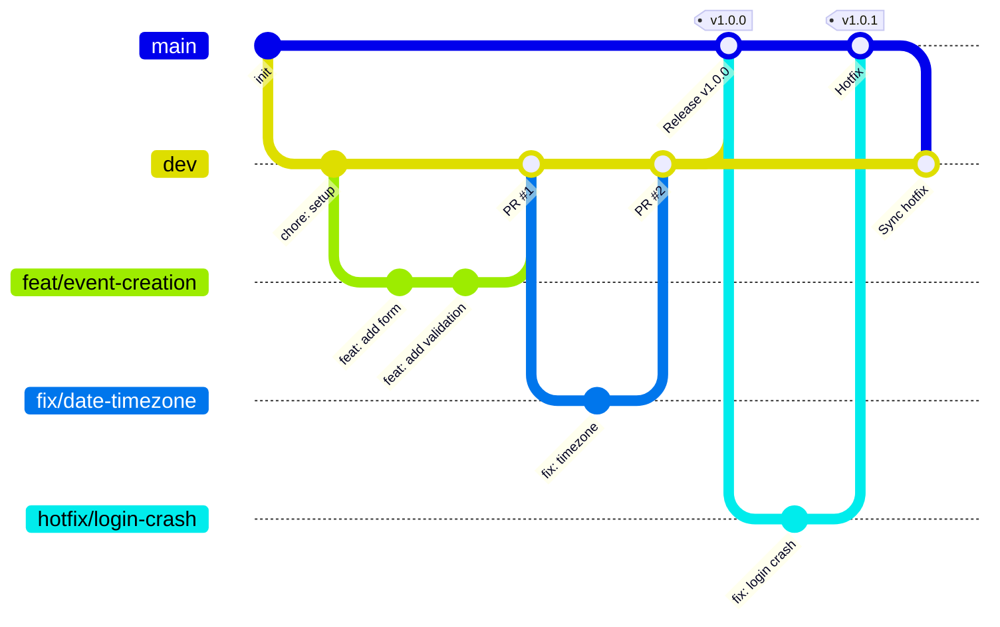

# Workflow Git

- `main` : branche de production. Elle contient uniquement du code validé et stable.
- `dev` : branche d’intégration. Les différentes fonctionnalités y sont regroupées avant leur passage en production.
- `feature/*` : branches éphémères utilisées pour développer les différents livrables ou fonctionnalités.

## Schéma du workflow

## Règles

1. Aucun push direct sur `main` ni `dev`.
2. Toute modification passe par une Pull Request.
3. Une PR doit avoir au moins 1 approbation et une CI verte.
4. Les commits respectent Conventional Commits (cf. section précédente).
5. Les branches sont supprimées après merge.
6. Titre de PR au format Conventional Commits (utile avec le squash merge).
7. Merge vers `dev` : squash merge. Merge vers `main` : merge commit (garde la trace des releases).
